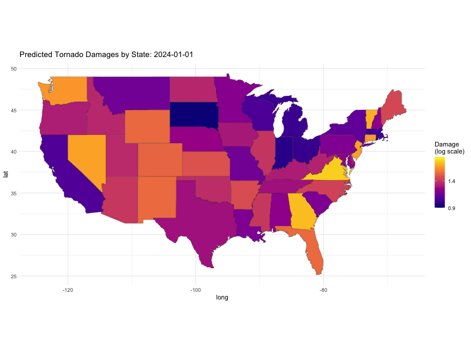
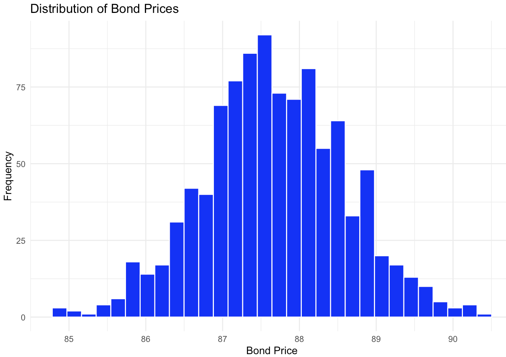

# Catastrophe Bond Pricing

## Project Overview

This project aims to predict and analyze the impact of tornado occurrences on the pricing of catastrophe bonds. Using historical tornado data and neural networks, we simulate the future impact on bond prices, incorporating stochastic interest rates via the Vasicek model.

## Directory Structure

-   `Tornado_Data_Download.R`: Downloads tornado event data from NOAA.
-   `Tornado_Data_Processing.R`: Processes the downloaded data for modeling.
-   `Neural_Net.R`: Trains a neural network on the processed tornado data.
-   `CAT_BOND_PRICING.R`: Simulates bond prices using the neural network predictions.
-   `US_MAP.R`: Generates a GIF visualization of tornado occurrences over time.

## Installation and Setup

Before running the scripts, ensure R and RStudio are installed. Additionally, install the necessary R packages using the following command: \`\`\`r install.packages(c("rvest", "dplyr", "readr", "nnet", "caret", "ggplot2", "gganimate", "tidyr", "lubridate", "purrr"))

## Usage Instructions

### 1. Data Download

Run `Tornado_Data_Download.R` to fetch the latest tornado data from the NOAA website. This script will save compressed CSV files in the `data/raw` directory.

### 2. Data Processing

Execute `Tornado_Data_Processing.R` to prepare the data for analysis. This includes cleaning, type conversions, and preliminary analysis.

### 3. Neural Network Modeling

Use `Neural_Net.R` to train a neural network model. This script processes the data, applies transformations, trains the model, and evaluates its performance.

### 4. Bond Pricing Simulation

Run `CAT_BOND_PRICING.R` to simulate catastrophe bond prices based on the outputs from the neural network. This script also incorporates discounting bond payouts using the Vasicek model to simulate future interest rates.

### 5. Visualization of Tornado Data

`US_MAP.R` generates a GIF showing the progression of tornado occurrences over time, visualizing the data geographically across the United States.

## Data Sources

Data is sourced from the National Oceanic and Atmospheric Administration (NOAA) available [here](https://www.ncei.noaa.gov/pub/data/swdi/stormevents/csvfiles/).

## Neural-Net Tornado Results

The GIF visualization above showcases the evolution of predicted tornado damages across the United States from January 1, 2024, to December 1, 2033. The use of a logarithmic scale is pivotal in depicting this data. A logarithmic scale, or log scale, plays a crucial role in making the data more interpretable. It enhances the visibility of more minor variations in lower damage values, which are crucial but can be overshadowed when raw numbers with large ranges are used directly. This scale compresses the higher values, allowing both small and large values to be presented in a more interpretable manner, thereby boosting stakeholders' confidence in their understanding of the data.

Throughout the decade, the visualization reveals a significant increase in tornado damage in numerous states. This is indicated by the transition from lighter to darker shades on the color scale, corresponding to higher damage levels on the log scale. The log scale's effectiveness lies in its ability to help stakeholders—from researchers to policymakers—easily understand and analyze the gradual increase in risk and damage over time. This aids in better disaster preparedness and efficient resource allocation, empowering stakeholders and making it a valuable tool for visualizing and interpreting environmental damage projections.

## Bond Price Distribution Analysis

The histogram displayed above represents the distribution of bond prices resulting from a Monte Carlo simulation. This simulation incorporates the Vasicek model to predict interest rates and adjusts bond prices based on simulated tornado damages. This approach allows us to estimate the variability in bond prices that could arise from fluctuations in interest rates and different damage scenarios.

### Key Features of the Simulation:
- **Risk Adjustment:** The bond payoff is calculated using a piecewise linear function that reduces the payoff as predicted damages increase, making the bonds sensitive to higher damage scenarios.
- **Central Clustering:** The majority of bond prices are centered around a value of 88, suggesting a moderate level of risk and return under the modeled conditions.

### Inherent Limitations:
1. **Model Assumptions:** The Vasicek model used for simulating interest rates assumes a mean-reverting stochastic process. This may not accurately reflect more complex behaviors seen in real-world interest rate movements, such as jumps or heavy tails.
2. **Parameter Sensitivity:** The results of the simulation are highly dependent on the parameters set for the Vasicek model, including the mean reversion level, speed, and volatility. Small changes in these parameters can significantly affect the outcome, potentially limiting the robustness of the simulation.

### Conclusion:
While the simulation provides valuable insights into how bond prices might respond to changes in market conditions and natural disasters, the inherent limitations of the model underline the importance of using a range of models and parameters to fully capture potential market dynamics.

## Contributing

We welcome contributions from the community. Please fork the repository and submit a pull request with your suggested changes.

## License

This project is open-sourced under the MIT License. See the LICENSE file for more details.

## Contact Information

For support or collaboration, please contact [euginematy\@gmail.com](mailto:euginematy@gmail.com).

## Acknowledgments

Thanks to NOAA for providing access to the storm data, and to all contributors who have worked on developing and testing this project.
